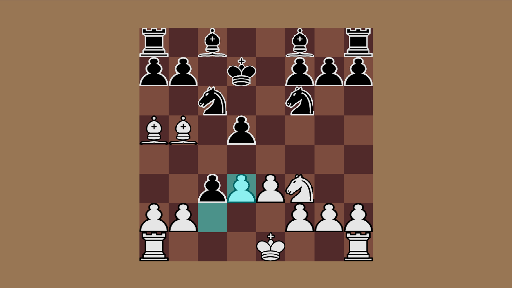

# Chess Engine
All code by Luke Guldberg<br>

## Building
The game is written in C++ and uses features from the C++17
standard. [CMake](https://cmake.org/) is used to build all components.
and works well with the
[CMakeTools](https://marketplace.visualstudio.com/items?itemName=ms-vscode.cmake-tools)
extension in VSCode.

Documentation: https://codedocs.xyz/LukeGuldberg/Chess/md_README.html <br>
Documentation is also generated on compile.

To configure it manually, type

```
cd build
cmake ..
```

then build it using

```
cmake --build .
```

Either method will generate an executable in the build directory.

## Running

Running this game requires the SDL2 library to be installed. This
is done very easily on MacOS and Windows through [MSYS2](https://www.msys2.org/#installation). <br>

In the MSYS2 terminal, the following command can be run to install the library and
configure all pathing for DLL files.<br>
`pacman -S mingw64/mingw-w64-x86_64-SDL2 mingw64/mingw-w64-x86_64-SDL2_mixer mingw64/mingw-w64-x86_64-SDL2_image mingw64/mingw-w64-x86_64-SDL2_ttf mingw64/mingw-w64-x86_64-SDL2_net`

The terminal used to run the game must be in the build directory to properly load all assets. From there, you can run `.\src\main.exe` (name of executable within build folder)

## Assets 

All assets used in this game were found on https://opengameart.org/content/chess-pieces-and-board-squares and are free to use. They are included in this repository. The sprites are manually initialized in a way that assumes the game is run from the build directory.

Assets are drawn to the screen within the `Engine` class. This class handles the conversion between pixel coordinates and chessboard tile indices. It draws all of the sprites initially, and then every time a move is made. When a change to the main game state occurs, all graphical changes are called from the Engine class, and executed within the Graphics class. Examples of what the Graphics class redraws to the screen every move are highlighted tiles, the board itself, and the pieces that comprise the board.

## Chess Board

The data structure used to store all of the data required is a one-dimensional vector of `Tiles`. Since the vector is one-dimensional, the positions of the board are represented by indices 0-63. Each `Tile` holds the value of a `std::optional<Piece>`. If the tile does not hold a piece, the value is `NULL`.

The Chessboard class recalculates data like what pieces can be attacked and how many pieces there are left every time there is a change to the game state. In addition, it also looks for current checks/checkmates and prevents moves that could result in a player putting themself in check. These are expensive checks, and leave much room for improvement for future versions of this engine.

## Game Flow

The game is run using the `Engine` loop that I created. It alternates who's turn it is, allowing either the user to move or the AI to decide on its best move and take it. When selecting a move to take, the `Piece` class regulates what moves can be made by doing checks on what piece is selected by the player. In addition to this, the Chessboard class does further checks before a move is made to confirm whether it is a legal move or not (see [pseudo-legal vs. legal moves](https://www.chessprogramming.org/Legal_Move)). The `Agent` class uses these same tools when finding a move.

## Agent

The AI component to this chess engine utilizes an algorithm called the [minimax algorithm](https://www.chessprogramming.org/Minimax). This algorithm uses a tree-like structure where each `Node` contains a `std::vector<Node> children`. The [minimax algorithm](https://www.chessprogramming.org/Minimax) algorithm traverses this data structure of depth `X` and assigns a score to every possible move. The score given is calculated based on the hypothetical game state's piece [mobility](https://www.chessprogramming.org/Mobility#Calculating_Mobility), total [piece value](https://www.chessprogramming.org/Simplified_Evaluation_Function#Piece_Values), and how [structured the pieces' formation](https://www.chessprogramming.org/Simplified_Evaluation_Function#Piece-Square_Tables) is.

One weakness of this agent is its end-game performance. It is not unlikely that if losing to the agent, the game will end in a stalemate. The agent is good at cornering the opponent's king, however, being sure that the opponent's king is checkmated is where it falls short. To help the agent in this situation, once the main game state reaches `X` number of pieces, it uses a different [Piece-Square Table](https://www.chessprogramming.org/Simplified_Evaluation_Function#Piece-Square_Tables) in the `evaluate()` function. This encourages the agent to push the opponent's king to the edges. Reaching stalemates is still an issue even after this change, but this is a step in the right direction of optimizing end-game moves.

## Where To Improve in Future Versions

This chess engine does not allow for two crucial moves: [castling](https://www.chessprogramming.org/Castling) and [en passant](https://www.chessprogramming.org/En_passant). To call this a complete chess engine, these need to be implemented.

As mentioned above within the Agent section, the agent struggles greatly with end-game decision-making. In addition to this, there is still plenty of room for improvement in the agent's decision-making at every stage of the game. One simple example that would benefit the agent would be to increase the depth of moves that the agent searches.

In order to do that, however, this engine must be refactored. The recurring calculation of looking for checks and only allowing legal moves is too expensive to increase the search depth at this stage of the engine. One example of how to do this would be to store the locations of pinned pieces, rather than iterating over every pseudo-legal move every time a player tries a move. This iteration of pseudo-legal moves is not too expensive for the user, rather it is too intense for the agent since it is not just testing one move at a time. The agent does this calculation for every possible game state.


